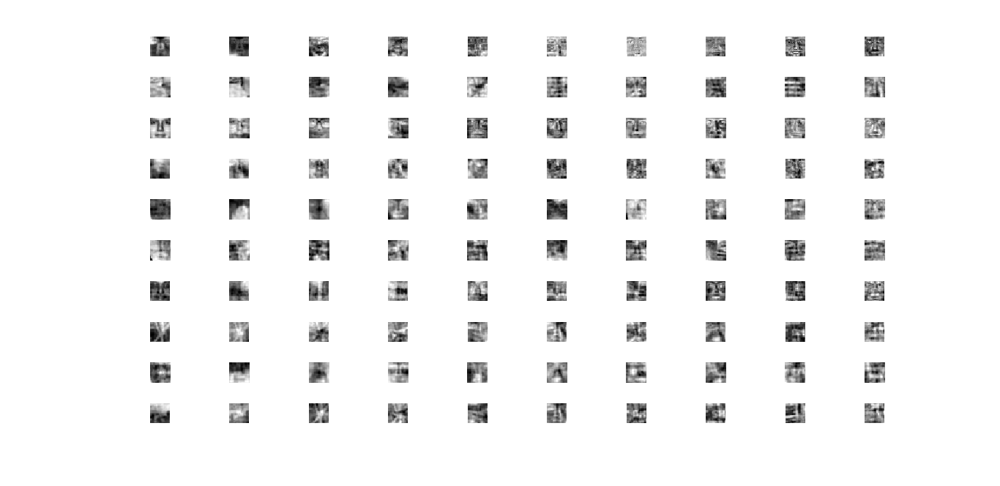

# fuzzy_kflats
Fuzzy K d-flats Clustering

Fuzzy K-means is a method for clustering that optimizes via an Expectation-Maximization algorithm but with a different kind of probability measure.
The K-flats algorithm expands upon Lloyd's algorithm to adjust K matrices and biases that lower the dimension of the data set.

Fuzzy K flats is an algorithm that uses both ideas.
